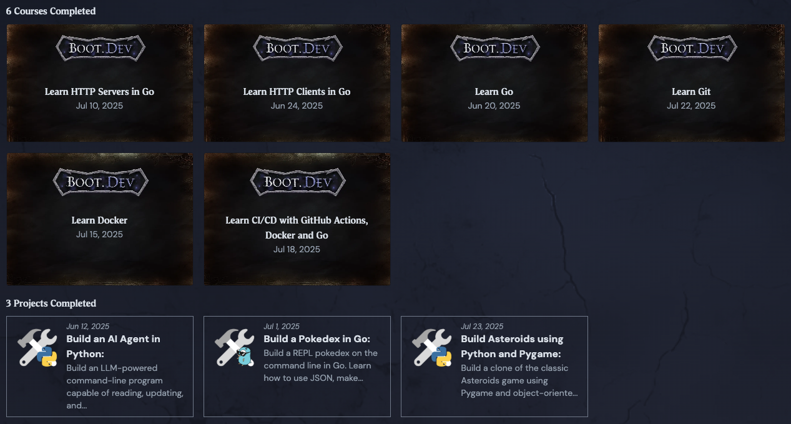
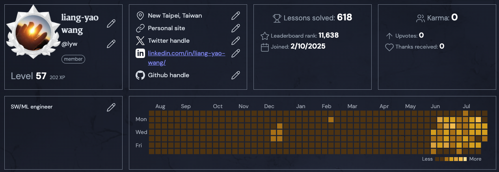

+++
date = '2025-07-30T17:57:18+08:00'
title = 'Software Developer Skills'
showDate = false
showReadingTime = false
showPagination = false
showAuthor = true

+++

I had the opportunity to work on several machine learning [projects](/wistron) in my previous job.
As a machine learning / data science team, we process, analyze, explore data and build models for specific problems. It was pretty interesting and satisfying, but sometimes I also wish to learn more about software development practices and skills. While model development is crucial, it takes a good system to be useful and create real-world value.

Last year, I decided it is time to take a break and grant myself a period to build up new skills.
The learning path wasn't initially clear as there are so many resources and possibilities out there. Eventually, I focus on these:

1. [LeetCode](https://leetcode.com/) + [NeetCode](https://neetcode.io/) For Data Structures and Algorithms.
2. [Boot.dev](https://boot.dev/): For Back-end Developer skills.
    
The choice was guided by my focus on strengthening fundamentals and extending the horizon beyond my machine learning expertise. And they both value actually writing codes and are designed to help you carry on.

## LeetCode 

The famous LeetCode site needs no introduction for a software developer. 

Although I have been coding for years, this is the first time I used it heavily.
It is much more challenging than I originally expected, but also pretty interesting and kind of addictive.
Resources like NeetCode and ChatGPT have made the learning experience much smoother. 

## Boot.dev

Boot.dev, provides a very practical learning path for a back-end engineer. The content covers plenty of elements I was looking for, such as the workflow of deploying an web application, authentication mechanism, managing database with migration, CI/CD etc. The lessons are designed as small coding problems to keep you forward step by step. And the projects challenge you to piece things together into a working program. 

Just like any lessons and tutorial, completing the exercises doesn't make me an expert. 
The lessons and projects are nice starters and I look forward to applying them in future projects. 

Below is a list of my completed courses, with links to my relevant github repo if present.

**Lessons**

- Learn Go
- [Learn HTTP Servers in Go](https://github.com/lywgit/bootdev_chirpy)
- Learn HTTP Clients in Go
- [Learn Git](https://github.com/lywgit/webflyx)
- Learn Docker
- [Learn CI/CD with Github Actions, Docker and Go](https://github.com/lywgit/learn-cicd-starter)

**Guided Projects** 

- [Build an AI Agent in Python](https://github.com/lywgit/bootdev_ai_agent_in_python)
    - My [post](posts/2025-06-13-ai-agent-fun) on this experience
- [Build a Pokedex in Go](https://github.com/lywgit/bootdev_pokedex_in_go)
- [Build Asteroids using Python and Pygame](https://github.com/lywgit/bootdev-asteroids-pygame)

## 2025-07-31

Pretty interesting to see how my Boot.dev contribution calendars follows that of my LeetCode's.

