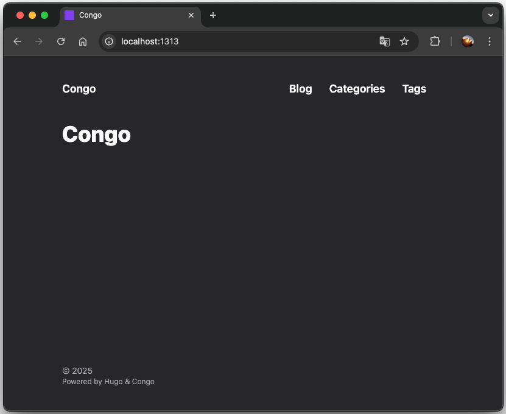

+++
date = '2025-08-07T00:00:00+08:00'
title = 'Setting up Hugo & Congo'
tags = ['tech', 'hugo']
+++

I mainly follow the steps in the [Congo theme installation](https://jpanther.github.io/congo/docs/installation/) document to setup and configure the site. I also refer to [Hugo Getting started](https://gohugo.io/getting-started/) document.

Here are the main steps I have taken to set up this site. You will need  `git` and `hugo` ready. 
I [installed Hugo](https://gohugo.io/installation/) with `homebrew`.

1. Initialize a local repository to work on
    ```bash
    # Create a base hugo directory structure
    hugo new site my-site
    # Initialize it as a git repository
    cd my-site
    git init
    ```
2. Install Congo theme as git submodule 
    ```
    # Install theme data to themes/congo
    git submodule add -b stable https://github.com/jpanther/congo.git themes/congo
    ```
3. Copy the default configuration files from `themes/congo/config/_default` into `config/_default` for customization.
    ```bash
    mkdir config
    cp -r themes/congo/config/_default config
    ```
4. Add a new line: `theme="congo"` to the `config/_default/hugo.toml` file to use Congo theme
5. Start local server and visit http://localhost:1313/
    ```bash
    hugo server
    ```
    If you see something like this, you are good to go.
    


## Some Tips

**Site configurations are in `config/_default/` folder**

Some useful ones:
- `hugo.toml`: basic setting
- `language.en.toml`: site title and author information 
- `menu.en.toml`: navigation bar items
- `params.toml`: customize site appearance such as color scheme, article information
- `taxonomies.toml`: enable tags for example by adding a line `tags = 'tags'` to this file


**Your content should be in `content/` folder**
Read more about [Page bundle](https://gohugo.io/content-management/page-bundles/).


**Site favicon should be in `static/` folder** 
See the [document](https://jpanther.github.io/congo/docs/partials/#favicons)

**Hugo build the site into `public` folder**
And you probably should never edit it. 
    
