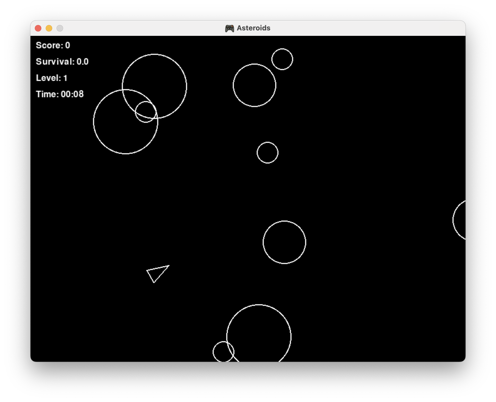
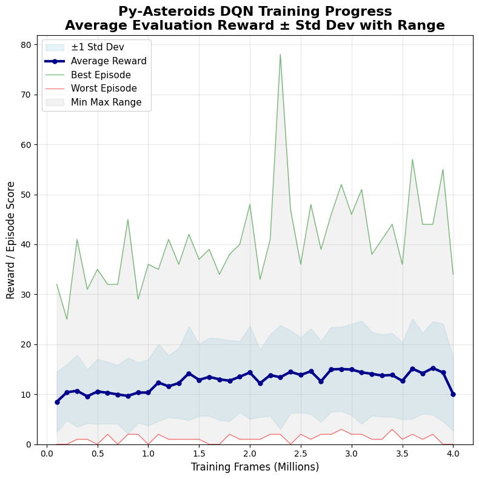

+++
date = '2025-10-10T11:25:00+08:00'
title = '強化式學習：Asteroids-AI 專案'
tags = ['tech', 'ml', 'zh']
+++

## 專案背景

### 緣起

先前因為對強化式學習的原理有興趣，曾花了一些時間接觸 Gymnasium 套件和跑一些練習，不過重複已經知道結果的實驗還是比較沒意思些。因此在因緣際會弄了一個 Python 的隕石射擊小遊戲之後，就決定進一步自己訓練一個 Agent 來玩這個小遊戲。

由於我主要是想要透過實作強化式學習問題的過程來及加深對深度學習的熟悉跟理解，因此決定從基礎 Deep Q Network (DQN) 開始，陸續入進階的方法並實驗，而沒有直接找最先進的方法或是套用別人寫好的程式。過程中我主要專注於理解方法以及實驗管理，開發上使用 AI 輔助。專案位於 [Asteroids-AI](https://github.com/lywgit/rl-asteroids-pygame)。 

### Py-Asteroids 小遊戲

這個用 Pygame 套件開發的小遊戲我稱之為 *Py-Asteroids* ，以避免與 Atari 2600 裡的 [Asteroids](https://ale.farama.org/environments/asteroids/) 遊戲混淆。如下方截圖所示，遊戲很單純，玩家可以操作飛船（空心三角形）前後移動、左右旋轉、以及開火射擊會直線移動的隕石（空心圓形）得到分數，有點類似簡化版的 Atari 2600 Asteroids 遊戲，不過操縱上沒有慣性的設計且飛船可以倒退。

原本的 [Py-Asteroids 遊戲](https://github.com/lywgit/bootdev-asteroids-pygame) 僅能供人類鍵盤遊玩，為了配合 RL 的訓練框架直接移植了一份到 [Asteroids-AI](https://github.com/lywgit/rl-asteroids-pygame) 專案中，重構修改後包裝成 Gymnasium 的環境框架供 Agent 互動。

## 專案成果

- ✅️ 完成 DQN + Rainbow 擴充機制的訓練主程式，應用於 Py-Asteroids 和 Atari 遊戲訓練 
- 🚧 在 Py-Asteroids 遊戲上習得策略，但尚未達到原本期望的水準（因資源因素，暫無法確認在最佳資源和訓練時間下各個遊戲上的最終表現）

#### 訓練影片



## 心得

在 AI 快速發展的今日，人類遊戲昔日的聖杯「圍棋」已被攻克，強化學習領域挑戰的遊戲也從經典 Atari 2600 遊戲提升到類似 Starcraft 或是 Minecraft 這樣的複雜環境，因此我一開始天真的以為相對基本的 DQN 方法應該就足以應付 *Py-Asteroids* 這樣的環境，實際進行後才發現我低估了這個挑戰。

作為出發點，我使用 Deep Q Network (DQN) + 經驗回放 (Experience Replay Buffer) 來訓練 Agent，但幾經嘗試都沒有好的結果，Agent 表現和 Random Action 一樣差。下一步首先加入了相對容易實作的 Double Network 和 Dueling Network 機制，同時引入其他 Atari 遊戲供驗證和比對以確認演算法的效果，接著再加入 Rainbow DQN 各項改進技術後一開始仍未有起色，直到最後嘗試加大資源（Experience Replay Buffer size & max training step），才終於出現正面的結果。

根據我自己的遊玩經驗，我一開始評估得分在 30~40 分是一個合理的目標，雖然目前的評估分數最高只上升到 15 左右（目前因為資源限制，暫時無法確認最終能夠表現得多好），但從評估分數的分佈可以確認 Agent 的策略確實有在優化中（如下圖分佈）。

#### 平均評估得分歷程

這一條上升的曲線得來不易，也是深度學習的一種醍醐味吧。實驗目前暫告一段落，後續再陸續紀錄一下過程及整理心得。
