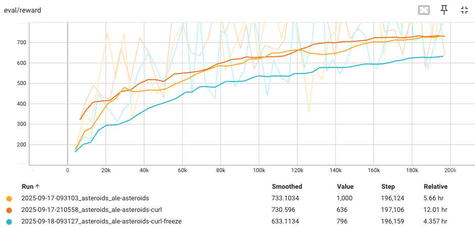

+++
date = '2025-10-19T12:22:00+08:00'
title = 'Asteroids-AI 專案：實驗歷程'
tags = ['tech', 'ml', 'zh']
+++ 

## 前言

在 [Asteroids-AI](https://github.com/lywgit/rl-asteroids-pygame) 專案中，我使用強化式學習的 Deep Q-Network (DQN) 方法嘗試訓練一個能玩 Py-Asteroids 小遊戲的 AI，專案背景可參考前文：[強化式學習：Asteroids-AI 專案]()。

**本文將從實驗的角度紀錄專案的歷程。**

## 1. 初探結果

由於 Py-Asteroids 是一個自製的小遊戲，我事先並不確定在上面訓練一個 Agent 的想法是否可行，但因為遊戲本身很單純，只需要開火和閃躲，並不需要任何推理，因此我一開始很樂觀的認為應該不會太難，還期待著不久就能看到 AI 酷炫的超人表現。

然而在初步將 Py-Asteroids 包裝成 RL 環境並嘗試訓練之後，我很快就發現作為出發點的 DQN + 經驗回放（Experience Replay Buffer）方法在這個遊戲上似乎無法奏效，也開始感覺到這個任務比可能我預期的更有挑戰性。

## 2. BeamRider 驗證

為了確認是不是訓練程式有問題，我決定先從經典 [Atari 2600](https://ale.farama.org/environments/complete_list/) 遊戲環境中選一個來跑看看能不能訓練成功。我對這些小遊戲的個別細節並不熟悉，簡單參考了 ChatGPT 的建議使用 [BeamRider](https://ale.farama.org/environments/beam_rider/) 做實驗。

以後見之明來看，BeamRider 的確頗適合拿來做基本的測試，由於玩家操作的飛船只會在畫面底部幾個固定位置左右移動以及開火，和飛船能在畫面上任意移動的 Py-Asteroids 比起來情況單純許多，而實驗結果也確實觀察到 DQN Agent 的平均評估得分隨著訓練過程提升，至少能確定目前的訓練程式運作正常！

實驗中也同步安排對批次大小（batch size）和經驗回放區大小（Experience Replay Buffer size）兩個超參數做了簡單比較，發現經驗回放區的大小 = 1e4 時模型訓練不起來，1e5 則可以。而批次 32 和 256 的最終效果接近，只是後者收斂速度看起來比較快一些。

附帶一提的是後我在觀察 BeamRider Agent 的過程中發現一開始得分的天花板居然是受限於環境設定的「最大互動次數」（max episode step）-- 由於原本設定的 1e4 太小，導致 Agent 還沒失敗但遊戲被提前中止。這提醒了我不能總是只看數字説故事，還是要觀察一下實際遊玩的情況。

## 3. 再訪 Py-Asteroids

既然 BeamRider 遊戲訓練得起來，下一步思考的是由我自行包裝起來的 Py-Asteroids 環境有沒有有什麼地方和 Atari 環境有明顯差異，會不會就是原因？

例如，原本遊戲中有一個每秒可以得到一個基本分數的存活分數機制，這和一般的 Atari 遊戲回饋比較不同（所以後續我選擇將這個分數保持關閉），又或者會不會是 Action 的映射方式有影響（僅允許單一動作或是完整多選的排列組合？），甚至也懷疑是不是原本遊戲畫面比 Atari 遊戲大，導致經過預處理 resize 後看不見必要的特徵。不過在調整設定後嘗試模型還是沒有成功。

排除了這些想得到的疑慮後，最有可能的因素就是遊戲本身較困難，而目前的訓練方法還不夠有效。因此我進一步在訓練程式中加入 Double Network 和 Duel Network 兩項 DQN 擴充，然而實驗結果還是沒有起色。

## 4. 嘗試 CURL 預訓練

我在研究的過程中注意到了[CURL](https://arxiv.org/abs/2004.04136)方法 -- 概念上是先以自監督學習的方式訓練 DQN 中的 CNN 使之能更有效的從環境抽取特徵。我很好奇自監督式預訓練在目前的問題是不是有幫助，於是決定在繼續加入其他的 DQN 改良之前嘗試一下。可惜如下圖所示，結果 Py-Asteroids 的訓練在一開始似乎有出現上升的趨勢，但也只是到達跟之前差不多的水準，得分也無法向上突破。

我個人覺得自監督式學習式的預訓練大方向是很有潛力的，只是我還沒有找對做法。當下評估自監督訓練的任務設計本身就是們學問，繼續深入下去恐怕會變成一條很長的支線任務，於是決定先放棄這個方向，維持加入 Rainbow DQN 改良的做法。

## 5. 觀察 Asteroids 遊戲

鑑於同樣的訓練方法在 BeamRider 的成功但在 Py-Asteroids 失敗，決定進一步拿 Atari [Asteroids](https://ale.farama.org/environments/asteroids/) 遊戲再實驗看看（也因此後續將自製小遊戲稱為 Py-Asteroids 以避免混淆）。Asteroids 的遊戲飛船可以移動到畫面上任何位置，操作方式和 Py-Asteroids 相似，

下圖的訓練結果顯示平均評估分數可以慢慢上升到 700 左右，似乎頗為成功。由於表現仍有上升趨勢，也接著嘗試更長時間的訓練或是嘗試使用較大的經驗回放，然而最佳表現大概還是只達到 800 左右。但要小心的是，雖然這個得分在帳面上看來頗為成功，但觀察遊實際玩的情況會發現 Agent 大概只學會開火可以得分，在移動的操作上並沒有觀察到什麼有效的策略，這個情況和 Py-Asteroids 很類似。

兩者的主要差異可能只在於 Py-Asteroids 的得分設定較低（擊中一個隕石只有 1 分），以及隕石會隨時間越累積越多，所以在 Agent 能夠學會有效射擊以及閃躲隕石之前，遊戲都會相對結束得很快，得分也就總是有限。

結論是雖然同為操作射擊遊戲，對 DQN 來說 Asteroids 比 BeamRider 難學得多。我判斷 Py-Asteroids 的 RL 環境包裝應該沒有問題，無法成功的原因是目前為止的訓練方法還不足以應對這種環境，而且這種侷限應該是無法透過調整超參數或遊戲設定而改善的。

## 6. Rainbow DQN 一線生機

考慮到目前為止的無果，決定是時候加入完整的 DQN 擴充試試了。方便起見我將此前的方法（DQN + 經驗回放 + Double Network + Duel Network）簡稱為 v1.0，完整加入 Rainbow DQN 擴充後的方法稱爲 v2.0。

v1.0 程式中能變化的超參數不多，大概就是 batch size / buffer size / max step & epsilon schedule。v2.0 裡各項機制可以調整的超參數不少，我只有嘗試調整 C51 的 value 範圍，因爲直覺這有機會限制到 DQN 的學習。

實驗方面，我決定擴大範圍到總共六個 Atari 遊戲來觀察 DQN 面對不同性質環境時的表現。由於從這個階段開始預設套用 Clip Reward 預處理，因此圖上分數範圍看起來會不太相同。六個 Atari 實驗的結果也有很多值得討論的地方，不過這裡僅專注在主角 Py-Asteroids 的實驗。

下面兩張圖分別是 v1.0 和 v2.0 的訓練，可以看到原本 v1.0 總是訓練不起來的的情況，在 v2.0 Rainbow DQN 上場後，分數終於首次出現令人振奮的向上趨勢！

但...就在我以為快要成功並滿懷期待了跑了更多實驗後，又被潑了一盆冷水，平均分數上升的趨勢在到達 12 左右之後就沒有能再繼續突破。

## 7. 發揮 Rainbow DQN 的真正潛力

至此，我幾乎想宣判 Rainbow DQN 並不足以應付 Py-Asteroids 遊戲了，但心中不免還是懷疑真的是這樣嗎？我是不是遺漏了什麼？

在想著是不是得開始研究其他強化式學習的方法的同時，我一邊看一下文獻一邊回顧跑過的實驗尋找方向，在觀察 [Enduro](https://ale.farama.org/environments/enduro/) 遊戲的訓練過程時注意到他一個回合（episode）裡的步數（step）相當的多，開始懷疑會不會是經驗回放區的大小不夠，沒辦法容納太多不同回合的情境，因而限制了訓練資料的多樣性，進而造成了學習的瓶頸。

目前為止我幾乎都固定使用 1e5 筆（100K）大小的經驗回放區，在這樣的設定下執行一個實驗大概需要佔用 22G 左右的記憶體（我一般會同時跑四個實驗）。為了確認這個想法我將經驗回放區的大小一口氣提高 9 倍達到 900K 來貼近文獻中使用的 1M，執行一個這樣的實驗需要佔用大約 200G 的記憶體，為此我還調高了雲端機器的記憶體資源上限。

沒想到，結果真的在 Enduro 遊戲上看到了突破：訓練過程中最高評估分數從原本的 400 多提高到 800 左右！

這個結果雖然令我振奮，但回歸到 Py-Asteroids 的環境上我其實並不抱太大希望，這是因為 Py-Asteroids 遊戲每回合的步數相對少，因此經驗回放區裡應該原本就放得下許多不同回合的資料，因此我其實預期這應該不是瓶頸，但當然還是要實驗看看。

實驗結果如下圖，紅色和紫色線是此前 100K 的最佳訓練狀況（紫色是延續紅色訓練的權重繼續訓練所以兩者都呈現），而 900K 的橘色線還真的突破了原本訓練過程的最佳表現！

雖然分數看起來還有上升的趨勢，但因為費用的考量我提前在 4M step 時就提前終止，這個實驗也成為這個專案現階段的最終結果。

我用訓練過程中存下的模型用於錄製遊玩影片並呈現於[強化式學習：Asteroids-AI 專案]()文章中。從一開始的完全訓練不起來到最後可以看到 Rainbow DQN 發揮效用，也算是個滿意的結果！
 
## 後記

我當然很想知道目前的訓練方法的極限，最後的實驗也帶來了許多的疑問。例如：會不會一直以來經驗回放區的大小才是真正的瓶頸？會不會關閉 Rainbow DQN 的某些擴充反而可以改善 Py-Asteroids 的表現（文獻中的消融驗實驗顯示某些擴充拿掉後某些 Atari 遊戲的表現反而是上升的），這些都需要實驗才能知道。

只是跑實驗的雲端機器所費不貲，一天得燒掉將近 2000 NTD，考慮到訓練的過程緩慢（部分原因是 Py-Asteroids 執行速度慢），只好決定先見好就收。專案中我使用 GCP 的雲端計算資源，累積實際費用大約 9000 NTD，若加上用掉的 300 USD 試用免費額度，總花費快接近兩萬元 NTD，果然玩深度學習是需要一些鈔能力的。

彷彿以另一種方式體會到「強化式學習的資料效率」為什麼會是個問題。

