+++
date = '2025-10-22T12:46:00+08:00'
title = 'Asteroids-AI 專案：Atari 實驗觀察'
tags = ['tech', 'ml', 'project', 'zh']
+++

## 前言

在「[Asteroid-AI 專案：實驗歷程]()」文中我回顧了在 Py-Asteroids 小遊戲上訓練 Agent 的實驗發展歷程，這篇文章補充紀錄其中略過的 Rainbow DQN Atari 實驗結果。

## 背景

在 [Asteroids-AI](https://github.com/lywgit/rl-asteroids-pygame) 專案中，訓練程式的開發經歷過兩個主要版本：
- **v1.0**：前期 DQN + 經驗回放 + Double Network + Duel Network 擴充
- **v2.0**：再接著加入 Prioritized Experience Replay, C51, Multi-Step Learning, Noisy Network 形成完整 Rainbow DQN 擴充

鑑於 Atari 遊戲本身的性質會影響到訓練結果，當時決定多納入幾個不同的遊戲來確認 Rainbow DQN 的效果。我使用了六個 Atari 2600 遊戲，分別為 Asteroids、Beam Rider、Centipede、Enduro、Pong、以及 Space Invaders。在[ALE 官方文件](https://ale.farama.org/environments/complete_list/)上可以看到遊戲畫面和簡單的說明，後面的遊戲畫面 gif 亦取自該網頁。

 
## 實驗結果

### Rainbow DQN 整體表現

根據我肉眼、非量化的觀察，v2.0 相對於 v1.0 的進步大概反映在三個面向上：
1. **學習效率提升** -- 分數提升較快
2. **最佳表現提高** -- 最佳得分更高
3. **訓練過程穩定** -- 表現的震盪幅度較小

每個 Atari 遊戲的表現並不相同，下表中我簡單整理了我的觀察結果，個別遊戲的結果可以在後面找到。

#### v2.0 和 v1.0 結果比較表
圖例說明： 🔺 提升  ☠️ 下降 ➖ 差不多或不明確

遊戲           | 訓練效率  | 最佳表現 | 穩定度
--------------|---------|---------|---------
1 Asteroids     | 🔺      | ➖      | ➖  
2 Beam Rider     | ➖      | ☠️      | 🔺
3 Centipede     | 🔺      | ➖      | 🔺
4 Enduro        | 🔺      | 🔺      | ➖
5 Pong          | 🔺      | ➖      | ➖
6 Space Invaders | ➖      | 🔺      | 🔺

整體來說，**Rainbow DQN 對模型的訓練普遍有幫助**。幾乎所有遊戲在三個指標上都是改善或至少持平的狀況，唯一的反例是 Beam Rider 在 v2.0 的訓練中達到的最高分數反而不如 v1.0。

雖然結果看起來相當正面，但我當時其實是蠻失望的，因為在這三個指標中我最在意的「模型最佳表現」僅在 Enduro 和 Space Invaders 上有明確的提升。

### 還能更好

還是必須補充說明的是：以上的觀察和比較是基於經驗回放（Experience Replay Buffer）大小 = 1e5 條件下的實驗結果，低於文獻中一般採用的 1M（1e6）。

如同我在「[Asteroid-AI 專案：實驗歷程]()」前文中紀錄：最後「加大經驗回放區間大小到接近 1M」的 Enduro 及 Py-Asteroids 實驗中，都觀察到最佳表現的進一步提升。參考下圖比較 v1.0（紫）、v2.0（綠）、和 v2.0 搭配加大後的經驗回放區（橘）在 Enduro 遊戲上的實驗結果，可以看到橘色線在最佳得分上的突破。

假使採用同樣的設定並且給予足夠的訓練時間，應該很有機會看到其他遊戲最佳表現的提升。

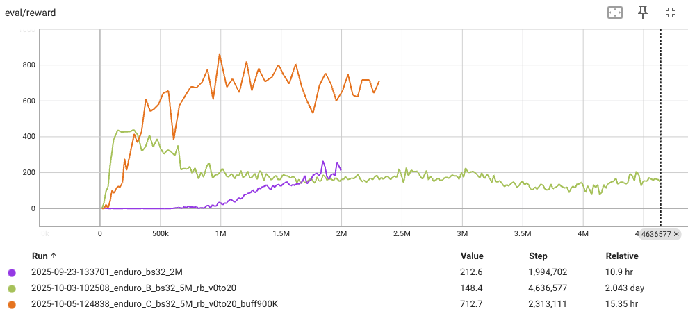

## 個別遊戲結果

**⚠️ 如前述，實驗都是在經驗回放區大小=1e5 的條件下進行，故不應將 v2.0 結果視為 Rainbow DQN 的最佳表現。**

在這一節中呈現每個遊戲各自的訓練結果，附上從官網複製來的樣本遊戲畫面方便想像遊戲性質。每個遊戲都以兩張圖分別呈現 v1.0 和 v2.0 的結果。

我在 v2.0 的圖上皆保留了一條 v1.0 裡的訓練結果方便直接對照比較（結尾為 _2M 的 case）。為節省資源，我有時會提早結束表現看起來不太會再上升的實驗，因此有些線條看起來比較短。

### 1. Asteroids
")

Asteroids 遊戲本身性質和 Py-Asteroids 遊戲相似，大概跟 Py-Asteroids 一樣也需要採用更大的經驗回放區才能看到突破，這裏的 Agent 大概都只是會開火的程度而已。不過還是可以看出 v2.0 對訓練效率的幫助。

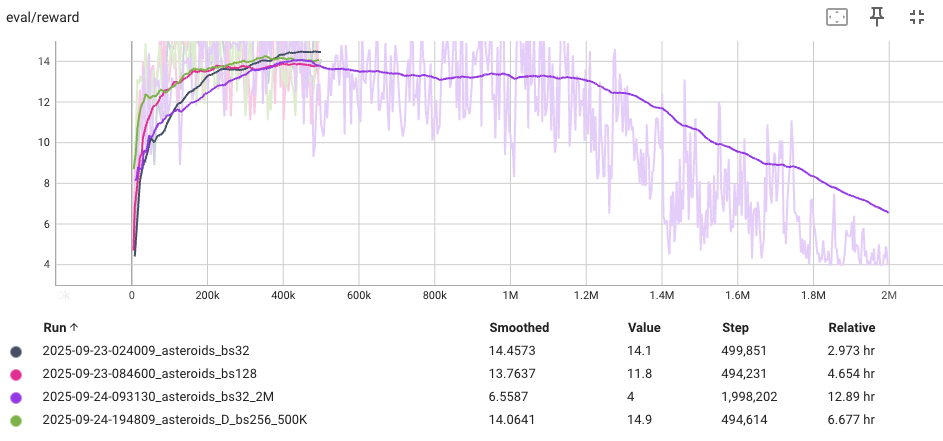
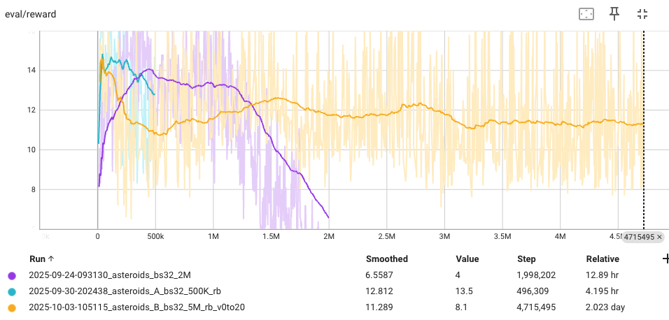

### 2. Beam Rider
")

Beam Rider 遊戲是這批實驗中唯一 v2.0 表現比 v1.0 差的，也許跟隨機探索有剛好沒有找到比較好的策略有關？

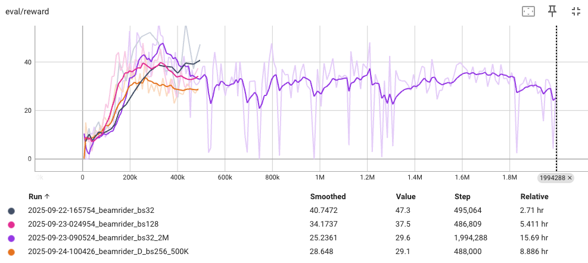

### 3. Centipede
")

Centipede 遊戲的 v2.0 結果其實在效率、最高分、穩定度三個指標上看起來都有改善，但因為 v1.0 在訓練過程中也曾短暫達到過差不多高的分數，所以我還是保守一點把最佳表現視為持平或不確定。

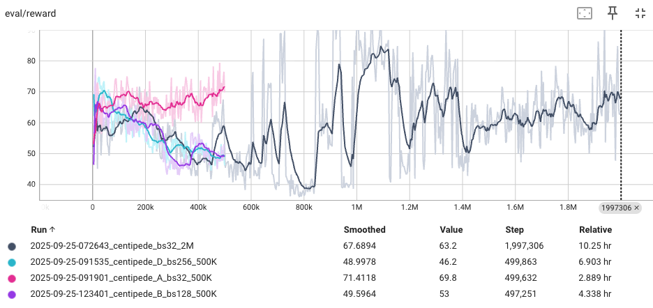
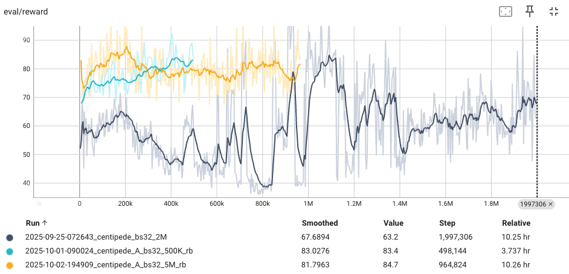

### 4. Enduro
")

Enduro 是個賽車遊戲，超過一台車得一分，所以他的分數範圍看起來特別高。由 v1.0 的結果來看有時候似乎運氣好比較快開竅，有時候則會探索一段很長的時間都沒有長進。v2.0 的訓練則都能在初期成功，某種程度上也能視為訓練穩定度的改善。

註：Enduro 有額外的經驗回放區大小=900K 的實驗結果，為了和其他遊戲一致這裡就不放上來，請參考前一節的說明及圖片。

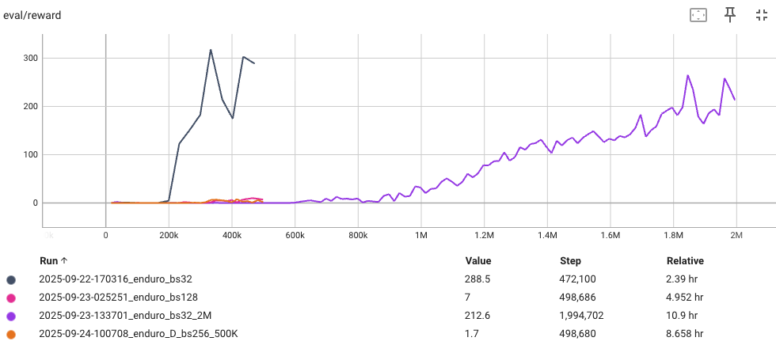
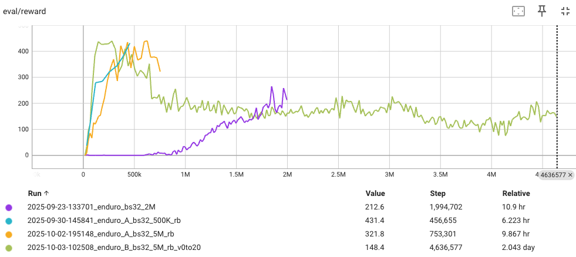

### 5. Pong
")

Pong 也算是 Atari 中的經典之一，分數計算方式是比 21 局，勝一局加一分，輸一局減一分，因此回合得分會落在 -21~21之間。
v1.0 的結果看起來也有相當的隨幾性，有時學得快，有時好像學不起來。和 Enduro 類似，v2.0 的方法明顯的提升了學習的效率。由於兩著都還有上升的趨勢，不能確定最終在最佳表現上會不會有影響。

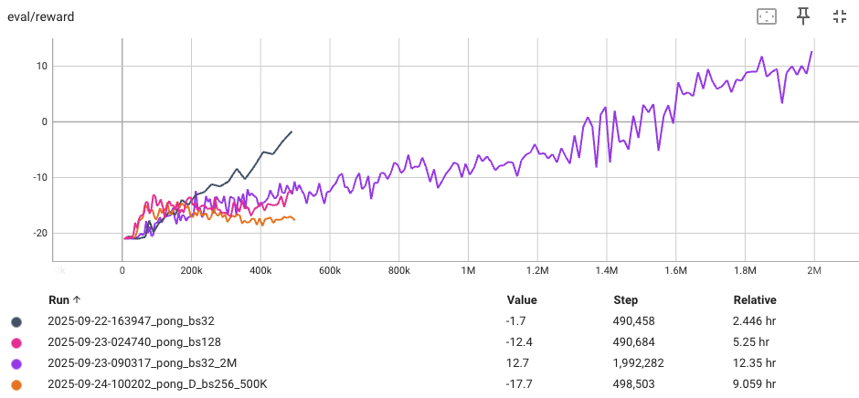
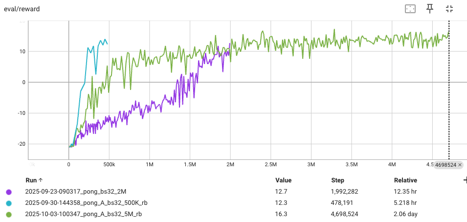

### 6. Space Invaders
")

SpaceInvaders 在 v1.0 中看起來卡在了某種不理想的區域最佳解（除了其中一個實驗似乎曾經超越這個障礙）。v2.0 則有效的避免了這個困境。這個遊戲其實也是在效率、最高分、穩定度三個指標上看起來都有改善，但因為 v1.0 曲線的型態比較混亂，不好明確的比較兩者的學習效率，所以還是保守的評估為持平或不確定。

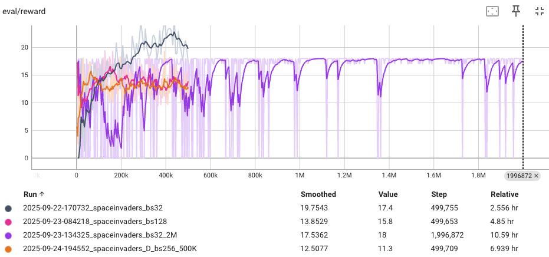
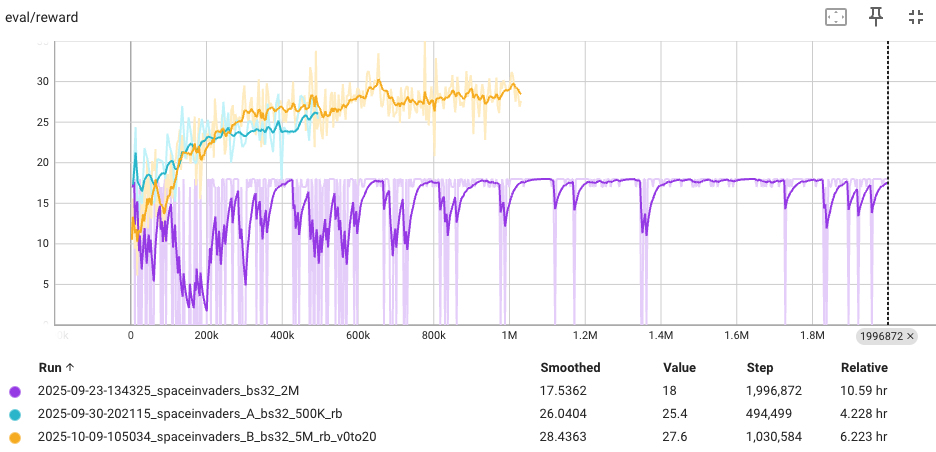

## 後記

在 Rainbow DQN 擴充機制中，我個人覺得最直覺的是 Prioritized Experience Replay；最有趣的則是取代 Epsilon 隨機探索機制的 Noisy Network 方法。從實驗結果可以感覺到良好的探索加上學習機制對於 Agent 的成功很重要，Exploration vs Exploitation 果然是 RL 的核心問題之一。Rainbow DQN 整合了一系列的改良機制成就了更有效率且更穩定的訓練機制，這雖然遠不是終點（反而比較像是個起點），但很好的反映了領域一步一腳印累積下來的成果。
