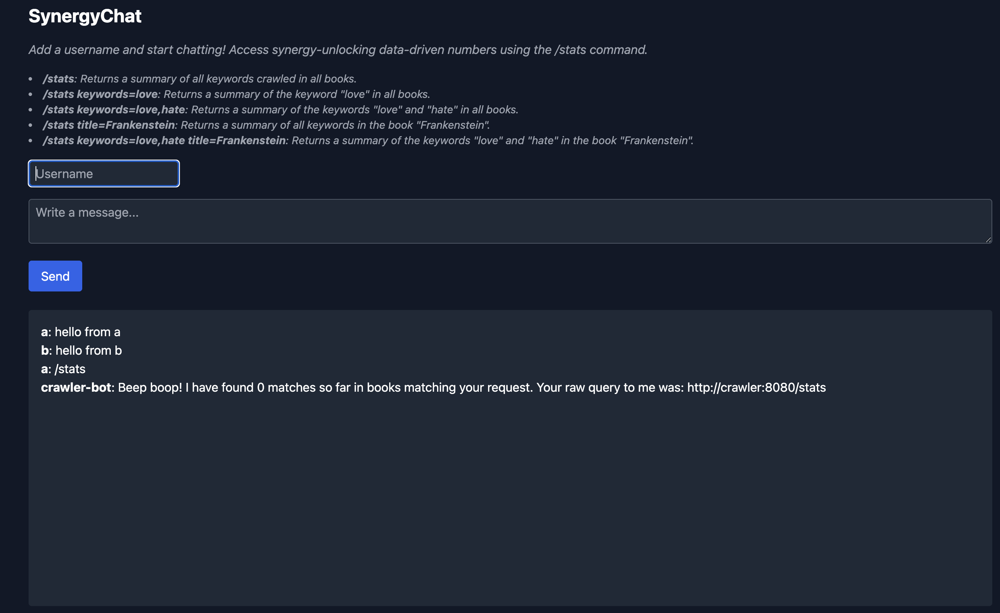
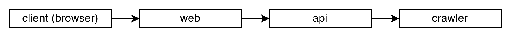
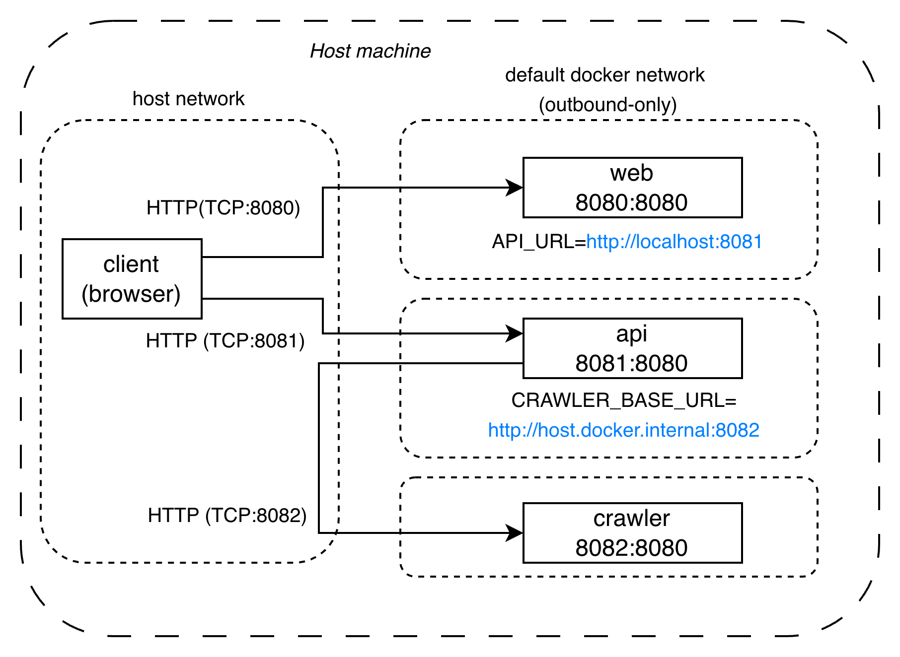
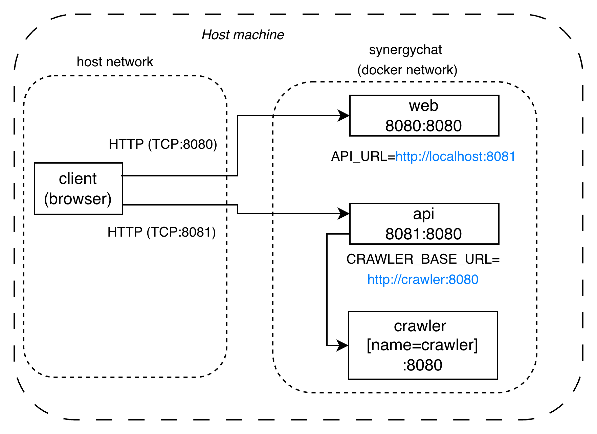
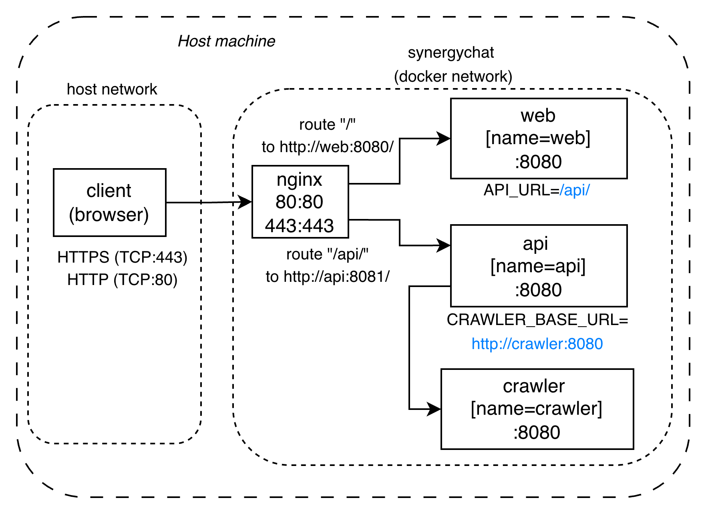
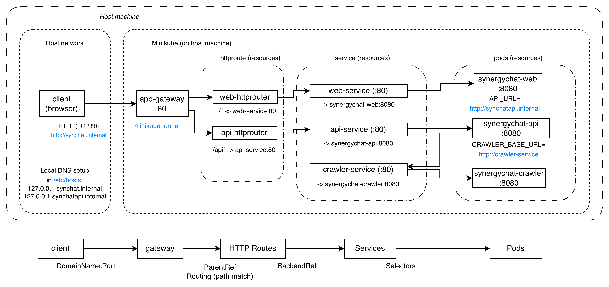
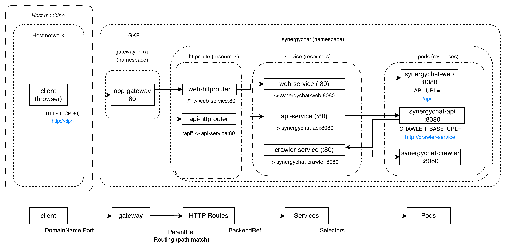

+++
date = '2025-11-25T17:25:00+08:00'
title = 'Kubernetes 與應用程式部署筆記'
tags = ['tech', 'k8s', 'docker']
showTableOfContents = true
+++

## 背景

機器學習模型的落地應用有許多形式，一種常見的作法是包裝成服務的形式來供客戶應用程式呼叫，客戶只需要拿到服務的網址並了解 API 的使用方式即可。獨立服務的好處之一是降低了程式之間的依賴，也讓模型替換或更新變得容易。
對機器學習工程師來說，雲端機器學習平台通常提供了 MLOps 相關的管線工具，因此模型部署有時候也只是簡單的點選操作。

久聞包含模型推論在內的許多網路服務底下都是以 Kubernetes（K8s）的方式來管理，但過去僅在專案中間接遇到過，本著「**多了解一層**」的精神，決定以實作補充一下相關知識。

## Learn Kubernetes

我以 Boot.dev 的 [Learn Kubernetes 課程](https://www.boot.dev/courses/learn-kubernetes) 為出發點學習 K8s 的主要概念，並順利完成將 [SynergyChat](https://github.com/bootdotdev/synergychat) 應用程式部署到本機 [Minikube](https://minikube.sigs.k8s.io/docs/) 叢集上的實作課題。由於課程的內容還是使用本機的 Minikube 而非真正部署到網路上，因此我進一步設定了兩個延伸目標：
1. **先退一步將 SynergyChat 服務在本機用 docker run 運行**。K8s 是自動化管理 docker 容器的工具，先確認自己能直接用容器把服務跑起來可說是基本。
2. **再進一步將 SynergyChat 服務部署到雲端 Google Kubernetes Engine（GKE）上**。Minikube 畢竟是以學習為主要目的，實際在 GKE 部署一次更接近真實情況。 

果然，很多一知半解的地方只有在沒有課程的輔助指引時才會真正暴露出來，這次的實作意外的幫助我釐清了對網路的一些理解，原因是 **SynergyChat 的架構是三個獨立的服務**，必須指定正確的服務路徑才能成功講整個功能串聯起來。

我總共嘗試了以下幾種不同的部署方式：
1. 本機以 docker run 執行個別容器或以 docker compose 一次執行
2. 本機／雲端 VM 加入 nginx 作為入口，以 docker compose 執行
3. 本機 Minikube 以 kubectl 部署（課程設計的方式）
4. 雲端 GKE 以 kubectl 部署

**本文紀錄我操作 K8s 的筆記，討論 SynergyChat 的串連，並回顧幾種部署方式形成的架構圖**。

由於最近剛好開始摸索 [Heptabase](https://heptabase.com/)的使用，過程中的一些指令資訊放在這個[白板](https://app.heptabase.com/p/whiteboard/ee4649d3-f97d-4f65-abcc-53ab75492519)中。相關的 YAML和 compose.yaml 檔案則放在 Github [bootdev-kubectl](https://github.com/lywgit/bootdev-kubectl)。

## Kubectl 筆記

- K8s 是自動化管理容器（container）的工具，以 Pod 為最小操作單位，一個 Pod 可以包含一或多個容器，並共享同一網路命名空間與 Volume。若使用 HorizontalPodAutoscaler 則 K8s 可以根據負載狀況來自動增加或減少 Deployment 的 Pod 副本數。
- 節點（Node）是握有 CPU 和 Memory 資源並運行容器的機器，叢集是由多個節點組成的邏輯集合。K8s 排程器 (scheduler) 會根據 Pod 的資源 requests 選擇合適節點
- 使用者只負責以 YAML 格式的文件定義、宣告資源規格，包含 Deployment、Gateway、HTTPRoute、Service 等等資源。使用者不進行類似 docker run 這種的實際操作。
- 使用者用 `kubectl` 命令列工具來跟 K8s 引擎溝通，例如以 `kubectl apply` 要求 K8s 套用新的資源規格。接下來由 K8s 負責實際的資源調度以滿足使用者設定的目標。
- K8s 會試圖調整實際資源以達到並保持使用者指定的狀態。假設目標和現狀皆為三個 Pod，此時你手動刪掉除其中一個，則 K8s 會自動重新起一個 Pod 來滿足目標。
- K8s 由稱為控制平面（Control Plane）的大腦負責接收 `kubectl` 的指令、定義及維持期望狀態等，節點上接收控制平面指令並執行動作的環境則稱為資料平面（Data Plane）。

## SynergyChat 應用程式

SynergyChat 是作者課程中用於部署的應用程式範例，畫面大概如下方圖片，功能類似於群組聊天，可以在輸入使用者名稱和訊息後送出（並沒有帳號管理和身份驗證等細節，因此只是個玩具範例）。其架構設計為三個分開的服務，各自包裝成可以直接部署的容器，功能如下：
1. ***Web***：供使用者訪問，負責回傳前端網頁（html、javascript）。要設定 `API_URL` 環境變數以呼叫 *Api*。 
2. ***Api***：實作對話功能的後端，負責提供資料的存取。輸入特殊指令 `/stats` 時會向 *Crawler* 發出請求並呈現取得的回應，要設定 `CRAWLER_BASE_URL` 環境變數以呼叫  *Crawler*。
3. ***Crawler***：獨立的功能，本身定時對外慢慢抓資料，在收到 *Api* 請求時依據當下的資料狀況回應結果。

我個人感覺這個設計頗有代表性，因為它包含了網路應用程式幾個重要的組成：前端使用者介面、後端 API、再加上其他內部服務，同樣的框架應該可以適用於很多情境。

### 分層架構

這樣的設計有著分層架構的優點，每一層只需要與相鄰層互動，實現了關注點分離。具體來說 *Web* 專注於使用者介面，*Api* 支援前端並調用 *Crawler* 服務（或著其他內部服務），*Web* 和 *Crawler* 原則上不需擔心彼此變動造成的影響。

### 實際串連

分層架構的模型對我們理解應用程式的設計很有幫助，但其中也簡化掉一些技術細節，例如從上圖來看 *Api* 似乎是躲在 *Web* 背後因此和使用者完全隔離，但這並不完全精確。

我在嘗試進行本地端 docker 部署時才意識到由於 *Api* 本身也是一個 HTTP server，其實是要能收到來自於客戶端瀏覽器的請求的，**因此這裡的分層架構圖雖然傳達了服務調用的流程，但並不反映技術上的連線過程**。分層架構的每一層類似於低解析度的大板塊，請求發生的連線路徑則是在高解析度的情況下看到的詳細道路。

由於 SynergyChat **獨立服務**的設計，這次的實作我花比較多時間了解的並不是使用 `kubectl` 指令或是如何在 GKE 網頁上建立叢集，反而是服務之間的請求要如何以網路連接。具體來說，要成功的串接筆必須正確的設定三組 URL：
1. 使用者需要 `CHAT_URL`：代表著**客戶瀏覽器如何請求 *Web* 服務**
    - 也就是 SynergyChat 應用程式的入口網址
    - 實際上沒有這個環境變數，只是取個變數方便討論。
2. *Web* 容器需要 `API_URL`： 設定**客戶瀏覽器如何請求 *Api* 服務**
    - 雖然變數是設定在 *Web* 容器中，但對 *Api* 服務的實際請求是從客戶瀏覽器發出。
3. *Api* 容器需要 `CRAWLER_BASE_URL`：設定 ***Api* 容器如何請求 *Crawler* 服務**。

這三個變數的設定取決於網路架構。

## 部署實作回顧

### 1. 本機 docker 執行

- `CHAT_URL` = http://localhost:8080
- `API_URL` =  http://localhost:8081
- `CRAWLER_BASE_URL` = http://host.docker.internal:8082

三個容器個別以 port publish 的方式將容器內部監聽的連接端口（port）公開給本機網路。也因為端口公開的緣故，客戶瀏覽器可以直接從 localhost 8080 和 8081 送請求給 *Web* 和 *Api*。

然而 *Api* 無法以名稱解析 *Crawler* 容器（真的要的話只能用浮動的內部 IP），因此這裡透過特殊的 http://host.docker.internal 繞回宿主（host）的網路藉以訪問 *Crawler* 公開的端口。更好的做法是自訂 docker 內的網路並直接使用容器名稱。

   
### 2. 本機 docker 執行 ＋ 自訂 network

- `CHAT_URL` = http://localhost:8080
- `API_URL` = http://localhost:8081
- `CRAWLER_BASE_URL` = http://crawler:8080

和前一項一樣，差別僅在將三個容器都放在同一個自訂的 docker network 中，如此一來 *Api* 可以直接透過容器名取得 *Crawler* 的 IP 並發送請求而不用繞回宿主網路。因此 *Crawler* 容器也就不需要公開端口。

### 3. 本機 docker 執行 ＋ nginx 代理伺服器

- `CHAT_URL` = http(s)://localhost
- `API_URL` = /api/
- `CRAWLER_BASE_URL` = http://crawler:8080

一樣用 docker 執行但加入 *NginX* 作為單一入口代理伺服器，公開 *NginX* 容器的 80 和 443 端口作為應用程式的 HTTP 及 HTTPS 入口（我沒有域名，只是用 self signed 的方式試一下 HTTPS）。NginX 有許多功能，這裡作為應用程式的入口，以及作為路由器依據客戶請求的網址來決定將請求導向 *Web* 或 *Api*，也會將 HTTP 請求直接導向到 HTTPS。

在這個架構中三個 SynergyChat 容器的端口都沒有公開，因此 *Web* 容器需要的境變數 `API_URL` 要改用相對路徑的方式設定為 /api/。同時我們在 [nginx.conf](https://github.com/lywgit/bootdev-kubectl/blob/main/docker-compose-with-nginx/nginx/nginx.conf) 中也必須設定路由器來將所有符合路徑前綴為 /api/ 條件的請求都轉發給 *Api* 容器（http://api:8080/），其餘的才交給 *Web* （http://web:8080/）。

這帶來一個疑問：在沒有域名的情況下（`API_URL`=/api/），客戶瀏覽器如何知道要向哪裡發出請求？答案是這利用到瀏覽器會在相對路徑的請求中預設套用當下的協議、域名和端口的行為，因此無論你是從哪裡訪問應用程式入口，發給 *Api* 的請求也會帶上一樣的域名，使用一樣的端口。

### 4. 本機 Minikube ＋ kubectl 執行

- `CHAT_URL` = http://synergychat.internal
- `API_URL` = http://synergychatapi.internal
- `CRAWLER_BASE_URL` = http://crawler-service

這個架構對應到 Boot.dev 課程裡的實作課題：使用 K8s 部署到本機的 Minikube。相對於 docker 來說 K8s 的架構需要額外定義一些資源：
- Gateway 資源提供一個統一的監聽入口，其 IP 可以作為應用程式的入口。
- HttpRoutes 負責監聽 Gateway 收到的請求，進行路由解析並轉發給對應的後端服務。
- Service 代表各別服務的抽象入口（*Web* 也是一個服務），負責選擇轉發請求給實際後端可用的 pod 來執行。

這些抽象化的資源分層讓我們可以將容器的管理交給 K8s 自行進行。

注意到：`CHAT_URL`=http://synergychat.internal 和 `API_URL`=http://synergychatapi.internal 這兩個域名之所以可以被解析及訪問是因為
1. 在課程的設計中我們進**編輯了本機的 /etc/hosts 檔案**，將 synergychat.internal 和 synergychatapi.internal 域名解析為 127.0.0.1。
2. 執行了 `minikube tunnel` 公開了 Gateway，因此本機的瀏覽器才可以直接訪問得到 Gateway 在監聽的 80 端口。

又因為服務的名稱在 K8s 內部網路中自動可以被解析，因此對服務的內部請求可以直接用名稱：`CRAWLER_BASE_URL`=http://crawler-service（不指定端口則預設為 80，與 crawler-service 監聽的端口一致）。內部 DNS 的完整格式為 service.namespace.svc.cluster.local，在相同 namespace 下則可以省略 namespace 部分。

### 5. 雲端 GKE ＋ kubectl 執行

- `CHAT_URL` = http://\<**CLUSTER_PUBLIC_IP**\>/
- `API_URL` = /api
- `CRAWLER_BASE_URL` = http://crawler-service

在 GKE 上部署的架構基本上和 Minikube 大致相同，但有一些細節上的差別和需要調整的地方：
- 要先去開一個 K8s 資源，安裝一些 google cloud 的命令列工具來連接上你開好的叢集。這次實驗我使用的是 GKE 的 Autopilot Mode，會自動幫你調整 Node 資源（相對於標準模式下你要自己管理 Cluster 的 Node）。
- 由於 Autopilot Mode 需要幫你自動安排資源，因此要求每個部署都需要強制定義 CPU／Memory 的 requests。
- 路徑的設定上 `CHAT_URL` 使用的就是 GKE 部署完成後自動安排給 Gateway 的公開 IP，因為我沒有自己的域名，也不像本機可以自行設定 DNS），另外兩個路徑就沒有差別。
- 課程中本地 Minikube 採用另外安裝的 Envoy Gateway 作為 Gateway 控制器，在 GKE 的實作中則是使用其原生支援的 Gateway 類別。
- 一開始部署時遇到對於 *Api* 服務的訪問一直顯示 "no healthy upstream" 的錯誤，後來找到可能的原因在於 Gateway 預設會以 `"GET /"` 的方式確認其後端的服務是否可用（預期 HTTP 200 OK），但是在 SynergyChat 中 *Api* 服務定義的 health check 路徑是 `/healthz` 而非 `/` ，導致 Gateway 一直認為 *Api* 沒有正常運作。在這個情況下會需要配置 HealthCheckPolicy 資源來指定確認的路徑（例如 [api-healthcheck-policy.yaml](https://github.com/lywgit/bootdev-kubectl/blob/main/gke/api-healthcheck-policy.yaml) ）。
   

### 補充

K8s 的使用上還有例如 Liveness Probe 和 Readiness Probe 等更多細節，真正面對大眾的應用程式還需要處理許多其他安全性問題，像是防火牆規則，服務之間的驗證等等，有機會遇到的話再來研究囉。

## 後記

除了部署上線是機器學習應用的一環之外，K8s 其實和機器學習沒什麼直接關係，這一次的實作主要目的還是基於我對系統架構的興趣想要擴大對後端和雲端服務的理解，一窺網路時代無所不在的「服務」背後的機制。

K8s 的行為給我一種很工程的感覺：pod 不夠就追加，用不到就減少，死掉了就嘗試起一個新的，把這些維運的操作規則自動化起來就對了。這讓我聯想到如今以大型語言模型為基礎的 AI 輔助或自動程式開發工具，正以超乎預期的速度打破原本程式設計與軟體開發的壁壘，相對於傳統意義上被明確寫成判斷邏輯的規則，大型語言模型可以表現出類似於人類的知識判斷，當這些判斷逐漸被用來「自動化」，可以預期將對社會造成很大的影響。