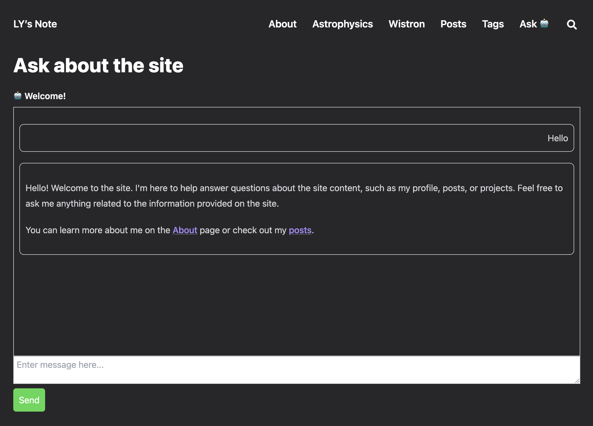

+++
date = '2025-12-23T17:53:00+08:00'
title = 'RAG 專案：Ask about the site 功能'
tags = ['project', 'rag', 'backend', 'cloud', 'zh']
draft = true
+++

## 專案背景

**Retrieval Augmented Generation**（**RAG**）是 LLM 常見的應用之一，其基本概念很簡單：在 LLM 回答問題之前，先從文件庫（資料來源）中搜尋、取得和問題相關的文件，再將文件內容作為脈絡的一部分交給 LLM 用於產生回答。

在完成 [Learn Retrieval Augmented Generation](https://www.boot.dev/courses/learn-retrieval-augmented-generation) 的實作後不久，我決定要將 RAG 方法應用於個人網頁的開放式問答。

個人過往的工作經驗是以資料分析、處理以及機器學習模型的開發為主，但也一直想要對機器學習應用的端到端流程能有更完整的理解。在這個專案裡我從頭到尾完成了後端功能的開發及部署上線，達成了一部分目標。

## 專案成果

- ✅️ 開發 RAG 服務 API Server：[RAG Server](https://github.com/lywgit/rag-server)
- ✅️ 包裝成 Docker 並部署於 Google Cloud Run
- ✅️ 建立開放式問答頁面：[Ask about the site](https://lywgit.github.io/ask/) 截圖如下

開發工作大概分為幾個面向：

1. **重新架構**：定義應用程式架構並重構 RAG 功能
2. **功能優化**：改寫 keyword search 支援中文斷詞
3. **後端功能**：以 FastAPI 建立 API 服務 
4. **部署上線**：打包爲 Docker 並部署於 Google Cloud Run
5. **前端呈現**：建立問答頁面的 Hugo 樣板
6. **安全考量**：使用 API Gateway 作為公開端點並限制 API 的呼叫頻率 

目前的版本已經可以滿足我的需求，主要的遺珠大概是 Chunking 和 Conversation History 核心功能尚未實作進去。

在系統架構方面原本構想了一些比較進階、完整的功能想要嘗試，比如説讓使用者登入以利管理 token 使用量；使用關聯式資料庫來儲存對話歷史；使用向量資料庫來取代目前全部讀進記憶體的做法等等，但這些對我目前的用例來說都是殺雞用牛刀，就先放在心裡了。

## 心得

RAG 為 LLM 提供了「文件庫」及「搜尋」的外掛，讓我們得以將最新、最相關的資料提供給 LLM 作為脈絡，彌補了其知識凍結和脈絡窗口大小的限制，也提高回答的可靠度和正確性。

搜尋功能是整體成效表現的關鍵，畢竟如果前頭無法正確的取得相關的文件，那接手的 LLM 也是無能為力。「關鍵字」和「語意」搜尋各有其擅長和適合的情境，效果到底好還是仍得透過設計實際的測試案例集來評估。

Gemini/ChatGPT 真的是好老師，對有方向但不熟悉的主題，可以不受限制的提問和學習，長知識。

## 問題回顧

### Sync vs Async

雖然原本就知道 Concurrency 在應用程式裡的重要性，但直到自己開發 API 時才會思考哪些函數操作應該要設計成非同步而哪些不用。我目前的理解大概是：
1. 作為後端的 FastAPI Server 應讓所有被呼叫的 API 方法都是 Async
    - 因為任何 Sync 的方法一但被呼叫就會佔住 Server 的執行，導致無法對任何其他需求做出反應
    - 當遇到需要執行的方法是 Sync 函數時，用 `anyio.to_thread.run_sync` 或 `asyncio.to_thread` 包起來執行，避免阻塞
2. 網路 IO、呼叫外部服務的函數方法（例如呼叫 Gemini API）應該要有 Async 的版本
    - 外包給原生 Async 的方法就保持 Async  
3. 高度使用 CPU 的工作和本地端的工作可以保持 Sync 版本
    - 要由 Server 自己完成執行的工作就如前述以另 thread 執行避免阻塞

### 中文斷詞

在 Learn RAG 課程中實作的的關鍵字搜尋是以英文文章為目標，我的文件（網站文章）卻是中英都有，原本的邏輯套用在中文文章上執行並不會出錯，但會產出沒有意義的結果（因為中文並不是靠空白來斷詞的）。幸好在重構的過程中發現這個狀況並修正，否則恐怕要留下個隱藏的大 bug 了。

### Google API Gateway

對於 Google Cloud Console 的 [API Gateway 產品](https://console.cloud.google.com/api-gateway/) 我目前的理解是這樣：
1. Google API Gateway 產品裡可以建立多個 API Gateway 資源。API Gateway 資源底下是 Managed Service
2. 個別 API Gateway 資源底下可以建立多個 API Config YAML 檔案。API Config 的功能是作為實際部署之 Gateway 背後的藍圖
3. 個別 API Gateway 資源底下可以建立／部署多個實際 Gateway，其內容由你指定的 API Config 定義 

可能是因為命名的雷同，我第一次使用的經驗其實是很混淆的。當我完成第一版 API Config YAML 檔並在 Cloud Console 進行 Create Gateway 的操作後，看見有一個 API Gateway 資源被建立起來，但一直找不到我預期的端點網址等等。直到花了一些時間研究了之後才了解前述三者的關係，並理解到我看到的是 API Gateway 資源而非實際 Gateway。而之所以是這樣是由於我第一版的 API Config 檔內容有錯誤，導致 Gateway 建立的程序的最後一步「部署實際 Gateway」是失敗的，因此留下了一個殘局。假設一切順利的情況下上述三件事情應該會一併建立完成。

### CORS & OPTION

為了安全性考量，這次我選擇建立一個 API Gateway 作為對外的公開入口，讓 RAG Service 躲在 Gateway 背後，並基於最小開放原則將 RAG Service 設定為需要驗證，再透過 service account 的權限設定僅讓來自 Gateway 的請求被接受，兩者的互動過程由 Google 替我們處理，因此省去了 JWT 的管理等等問題。

然而在這樣的設定之下我卻遇到意外的 CORS Cross-Origin Resource Sharing（跨來源資源共用的設定）問題。為了安全，網頁瀏覽器預設會遵守「同源政策」（同源＝相同 Protocol＋Domain＋Port），對於任何一個網頁 A 來說，瀏覽器僅會允許其使用來自同源伺服器的資料或結果，以避免惡意的網站 A 利用你在站 B 的登入資訊來向 B 發起請求並取得機密資訊並回傳給 A。但假設正常的 A 網站確實需要使用來自非同源 B 的結果，則 B 需要在回傳的表頭「明確的允許」，這也就是 CORS 的意義。然而這次的問題是即使我的 FastAPI Server 程式中設定了開放所有方法及域名：`allow_origins=["*"], allow_methods=["*"], allow_headers=["*"]`，透過 Gateway 向 Rag Service 發請求時卻還是遭遇到 CORS 的錯誤。

經過一番研究發現問題在於 Gateway 的 API Config（[我的例子](https://github.com/lywgit/rag-server/blob/main/openapi-run.yaml) 的設定，有好幾層：
- 瀏覽器會先發出 `OPTIONS` 方法的 Preflight Request 向伺服器確認 CORS 是否被允許，因此不只是 `GET` 和 `POST`，也需要定義路徑如何回應 `OPTIONS` 的請求。 
- Google API Gateway 支援這樣的設定 `x-google-endpoints: ... allowCors: True ` ，預設會處理掉 OPTIONS 問題
- 然而因為我的後端需要 JWT 驗證，透過上述設定讓 Google 自動幫忙處理的 `OPTIONS` 請求卻是不帶 credential 的，因此後端的 RAG Server 卻不接受這個 Preflight
- 因此還是要明確的定義處理 `OPTIONS` 的方法，並和其他方法的後端一樣帶上 JWT credential

最後，由於我允許 Cloud Run 將 RAG Service 在沒有使用時將容器數目降到零，因此新的請求可能會有意料之內的暫時失敗，只不過是這種後端還沒準備好的失敗在瀏覽器的 Developer tool 中查看不知為何顯示是 CORS 問題，這也讓我一開始很混淆。
