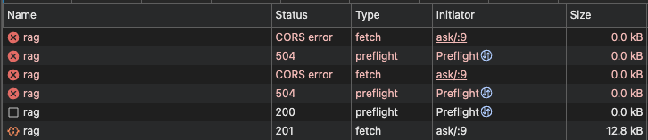

+++
date = '2025-12-25T14:56:00+08:00'
title = 'RAG 專案：Ask about the site 功能與部署'
tags = ['project', 'rag', 'backend', 'cloud', 'zh']
showTableOfContents = true
+++

## 專案背景

**Retrieval Augmented Generation**（**RAG**）是 LLM 常見的應用之一，其基本概念很簡單：在 LLM 回答問題之前，先從文件庫（資料來源）中搜尋、取得和問題相關的文件，再將文件內容作為脈絡的一部分交給 LLM 用於產生回答。

在完成 [Learn Retrieval Augmented Generation](https://www.boot.dev/courses/learn-retrieval-augmented-generation) 的實作後不久，我決定要將 RAG 方法應用於個人網頁的開放式問答。

個人過往的工作經驗是以資料分析、處理以及機器學習模型的開發為主，但也一直想要對機器學習應用的端到端流程能有更完整的理解。在這個專案裡我從頭到尾完成了後端功能的開發及部署上線，達成了一部分目標。

## 專案成果

- ✅️ 開發 RAG Server API：[RAG Server](https://github.com/lywgit/rag-server)
- ✅️ 包裝成 Docker 並部署於 Google Cloud Run
- ✅️ 建立開放式問答頁面：[Ask about the site](https://lywgit.github.io/ask/)


## 需求與功能討論

這次的開發工作大概分為幾個面向：

1. **重新架構**：定義應用程式架構並重構 RAG 功能
2. **功能優化**：改寫 keyword search 支援中文斷詞
3. **後端功能**：以 FastAPI 建立 API 服務 
4. **部署上線**：打包為 Docker 並部署於 Google Cloud Run
5. **前端呈現**：建立問答頁面的 Hugo 樣板
6. **安全考量**：使用 API Gateway 作為公開端點並限制 API 的呼叫頻率及使用者輸入字數上限 

目前的版本已達成了專案設定的「個人網頁問答」目標，主要的遺珠大概是 Chunking 和 Conversation History 核心功能尚未實作進去。由於總共文章數量只有數十篇，就算一次全部餵給 LLM 大概也行，但採用 RAG 的好處是不用擔心 context 過大帶來的負擔。 

至於採用 Cloud Run 部署則是考量其便利性和經濟性，如果選擇讓 Scaling Min = 0 則可以在沒有收到需求時自動將服務的數量降到零，避免無謂的開銷。只是採取這樣的做法也有其代價，以我的情況來說服務冷啟動需要大概一兩分鐘時間，因此使用者一開始幾乎肯定會遭遇到請求逾時的錯誤，這種使用者體驗對一般應用程式來說應該是完全不能接受的。

專案一開始我還構想了一些比較完整的功能，例如説讓使用者登入以管理 token 使用量；使用關聯式資料庫來儲存對話歷史；使用向量資料庫來取代目前全部讀進記憶體的做法等等，不過這些對我目前的用例來說大概都是殺雞用牛刀，因此還是保持簡單，避免過度設計。

## 問題回顧

以下紀錄一些開發過程中印象比較深刻的問題以及 Lesson Learned。

### Sync vs Async
-- **以 Async 支援網路應用程式**

雖然原本就知道 Concurrency 在應用程式裡的重要性，但直到自己開發 API 時才會思考哪些函數操作應該要設計成非同步而哪些不用。我目前的理解是：
1. 作為後端的 FastAPI Server 應讓所有被呼叫的 API 方法都是 Async
    - Sync 的方法會佔住 Server 執行，導致無法對任何其他需求做出即時反應
    - 當遇到需要執行的方法是 Sync 函數時，用 `anyio.to_thread.run_sync` 或 `asyncio.to_thread` 包起來執行，避免阻塞
2. 網路 IO、呼叫外部服務的函數方法（例如呼叫 Gemini API）應該要有 Async 的版本
    - 外包給原生 Async 的方法就保持 Async  
3. 高度使用 CPU 的工作和本地端的工作可以保持 Sync 版本
    - 要由 Server 自己完成執行的工作就如前述以另 thread 執行避免阻塞


### 中文文章 
-- **資料的不同也會造成問題**

在 Learn RAG 課程中所實作的的「關鍵字」搜尋部分是以英文文章為範例，而在我的應用裡文件是中英都有的。原本程式的預處理邏輯執行在中文文章上並不會產生錯誤，然而產出的結果卻是完全沒有意義（因為中文並不是靠空白來斷詞的）。幸好在重構的過程中發現這個狀況並修正，否則恐怕要留下個隱藏的大 bug。

在這個專案中我沒有撰寫單元測試，不過除非一開始就有想到多國語言這個因子，否則就算有撰寫測試，test case 恐怕也不會涵蓋到。 

### Google API Gateway
-- **使用服務或產品，還是要了解其設計概念**

對於 Google Cloud Console 的 [API Gateway 產品](https://console.cloud.google.com/api-gateway/) 我目前的理解是這樣：
1. Google API Gateway 產品裡可以建立多個 API Gateway 資源。API Gateway 資源底下是 Managed Service
2. 個別 API Gateway 資源底下可以建立多個 API Config YAML 檔案。API Config 的功能是作為實際部署之 Gateway 背後的藍圖
3. 個別 API Gateway 資源底下可以建立／部署多個實際 Gateway，其內容由你指定的 API Config 定義 

可能是因為命名的雷同，我第一次使用的經驗其實是很混淆的。當我完成第一版 API Config YAML 檔並在 Cloud Console 進行 Create Gateway 的操作後，看見有一個 API Gateway 資源被建立起來，但一直找不到我預期的端點網址等等。直到花了一些時間研究了之後才了解前述三者的關係，並理解到我看到的是 API Gateway 資源而非實際 Gateway。而之所以是這樣是由於我第一版的 API Config 檔內容有錯誤，導致 Gateway 建立的程序的最後一步「部署實際 Gateway」是失敗的，因此留下了一個殘局。假設一切順利的情況下上述三件事情應該會一併建立完成。


### CORS & OPTIONS Preflight
-- **網路溝通的領域知識**

為了安全性，我建立一個 API Gateway 作為對外的公開入口，讓 RAG Server 作為背後的服務僅允許 API Gateway 透過 service account 賦予的權限呼叫，兩者的互動過程由 Google 替我們處理，因此省去了自行管理 JWT 的麻煩。使用時向 API Gateway 的 `query/rag` 發出 `POST` 請求。不過這樣的架構在瀏覽器的 CORS（Cross Origins Resource Sharing）機制下卻讓我卡關了一段時間。

我對 CORS 機制的理解：網頁瀏覽器預設會遵守「同源政策」，其中同源指的是相同 Protocol＋Domain＋Port，對於任何一個網頁 A 來說，瀏覽器預設僅允許其使用來自同源伺服器的請求結果，用意是避免網站 A 惡意的利用你在其他頁面 B 的登入資訊來向 B 發起請求取得機密資訊並洩漏出去。因此假若 A 網站真的需要跨來源向 B 發出請求，則 B 需要在其回應的表頭中明確的允許，

而我遇到的問題是：即使在 Rag Server 程式中做了相關的設定（[FastAPI 文件](https://fastapi.tiangolo.com/tutorial/cors/)），請求卻還是遭遇到 CORS 的錯誤，原因如下。

#### OPTIONS 與 allowCors

為了能讓 API 能夠支援非同源的網頁，我參考[Google API Gateway 文件](https://docs.cloud.google.com/api-gateway/docs/oasv2-extensions#configure_cors)的例子在 API Config 裡做了 `allowCors` 的設定，但是遭遇到 `405 Method Not Allowed` 錯誤。
```yaml
x-google-endpoints:
  - name: "test-gateway-a331xntq.an.gateway.dev"
    allowCors: True
```

原因是因為 `allowCors=True` 做的事情大概是在回應中加入 **Access-Control-Allow-Origin** 相關表頭資訊以讓瀏覽器看到正確的 CORS 設定。但在請求較複雜的情況下（例如 `POST`），瀏覽器其實會先發出一個 `OPTIONS` 方法的 Preflight Request 來向伺服器確認 CORS 的權限資訊，如果 Preflight 通過才會接著送出原本的請求。

然而 API Config 中雖然有 `POST query/rag` 但並沒有 `OPTIONS query/rag`，因此得到了 **Method Not Allowed** 的回應。看來 `allowCors=True` 應該只能幫忙自動處理掉瀏覽器沒有使用 Preflight 的情況（例如 `GET`，我沒有再深入驗證）。

解決方法其實就是替每個 API 明確定義 OPTIONS 方法（我後來採取的[做法](https://github.com/lywgit/rag-server/blob/7410a132f3d3350b496e1c33062ac62d2a54a0c9/openapi-run.yaml#L123)是把所有路徑的 `OPTIONS` 方法請求統一處理）。雖然感覺有些冗餘，但站在 Gateway 設計的角度來說，只允許明確定義的路徑和方法通過的確會是比較謹慎、避免產生漏洞的做法。

### 被遮蔽的 Cold Start 逾時錯誤
-- **仔細確認錯誤回饋**

在除錯的過程中有個蠻大的坑是沒注意到 CORS 錯誤可能並不是真正失敗的原因。

由於我在 Cloud Run 的自動調節設定中允許 RAG Server 容器數目降到零以節省花費，因此新的請求會在服務冷啟動時有「意料中」的逾時失敗，但這種初步的失敗在瀏覽器 Console 的訊息卻會顯示和 CORS 有關：
```text
Access to fetch at 'https://gateway.../query/rag' from origin 
'https://...' has been blocked by CORS policy: Response to preflight 
request doesn't pass access control check: No 
'Access-Control-Allow-Origin' header is present on the 
requested resource.
```
後來我才注意到實際上發生的是 **504 Gateway Timeout**，只是瀏覽器每次只要跨來源請求沒有拿到預期中結果，都會不管三七二十一回報 CORS 錯誤。


誤判的實驗結果造成了我的混淆，一度還讓我懷疑是 Gateway 和 RAG Server 之間的身份驗證或是 Gateway Security 設定有問題，頭痛了一段時間。


## 心得

### RAG 
- RAG 為 LLM 提供了「文件庫」及「搜尋」的外掛，讓我們得以將最新、最相關的資料提供給 LLM 作為脈絡，彌補了其知識凍結和脈絡窗口大小的限制，也提高回答的可靠度和正確性。
- 搜尋功能是整體成效表現的關鍵，畢竟如果前頭無法正確的取得相關的文件，那接手的 LLM 也是無能為力。
- 「關鍵字」和「語意」搜尋各有其擅長和適合的情境，效果到底好還是仍得透過設計實際的測試案例集來評估。

### 軟體設計
- 軟體開發讓人開心的一點是知識與實踐的串連，以及理解的修正與深化。在這方面上 AI 真的是學習良伴，任何想釐清的觀念都可以盡情地發問。
- 這次專案的**程式架構**我是從和 AI 的討論開始，發現他建議了 domain 和 infrastructure 等資料夾，喚醒了我之前閱讀「領域驅動開發」的記憶。專案完成之後再請 AI 分析一次架構，回饋認為分層架構的設計有符合 Clean Architecture / Hexagonal Architecture（Ports & Adapters）的原則
- 很快查了一下[六角形架構](https://ithelp.ithome.com.tw/m/articles/10376821)，看起來雖然是不同的框架但有著相似的精神。第二次看到肯定比第一次接觸更親切一些，期望從不同的角度多看幾次後能更掌握共通的精神。
- **安全性**的考量也是一個新的經驗，由於 static site 的內容基本上是全公開的，第一次思考公開面向的應用程式如何避免被濫用。查到的安全措施大概是「限制流量」和「限制訪問來源」兩個方向，也是這次採用的做法。雖然感覺無法解決所有的情況，但似乎也沒有簡單又絕對安全的做法，資安果然是個專業領域。
- 當然，AI 也指出許許多多的缺失和改善的方向，雖然想把事情做到最好，但也要提醒自己適時地 Move on！
